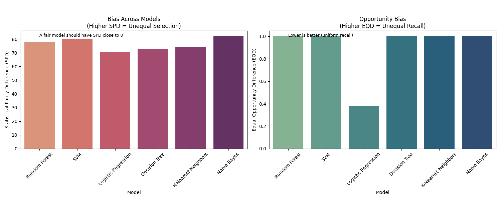
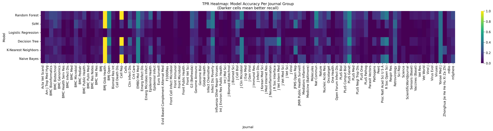
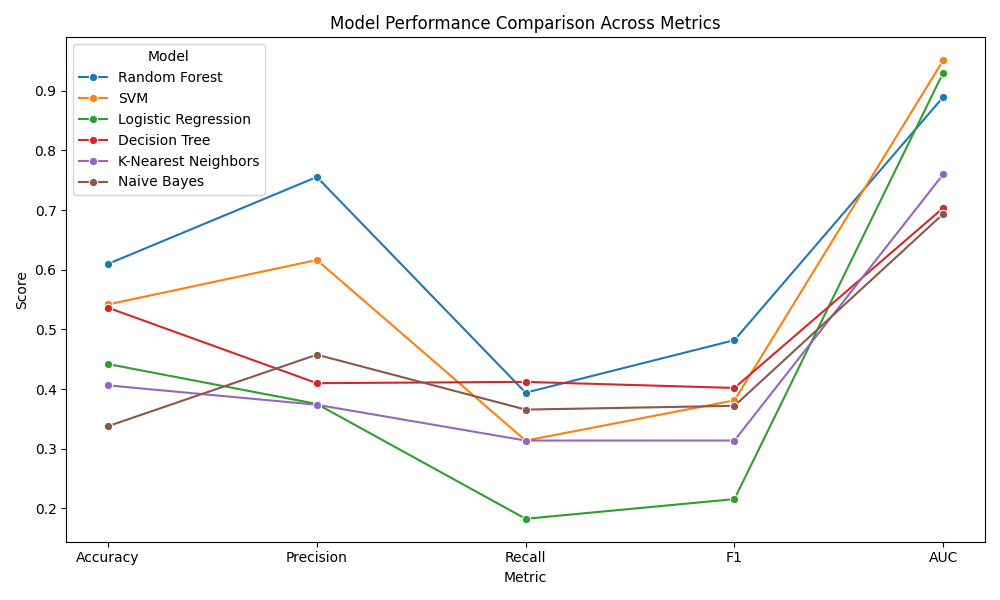
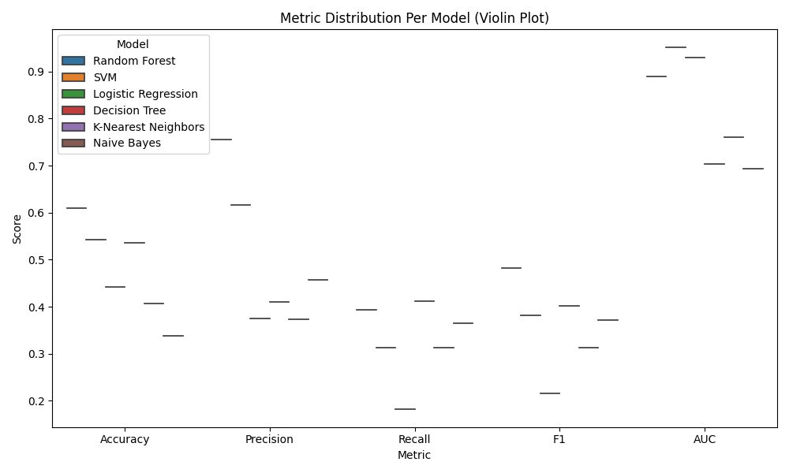
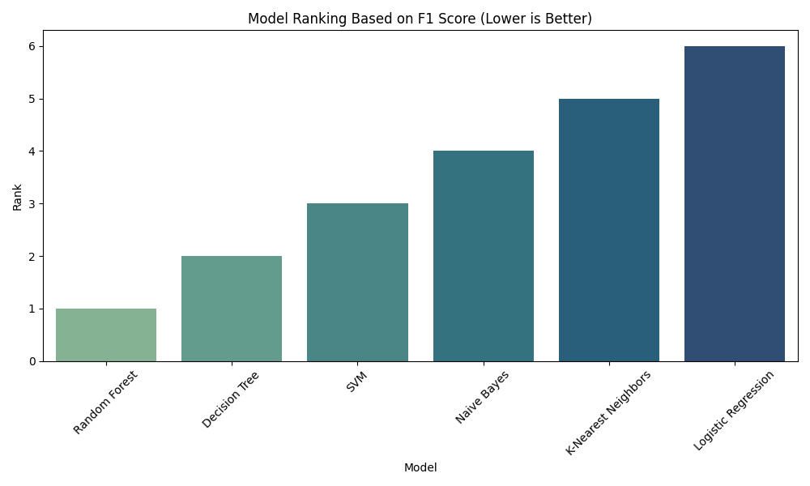

<div align="center">

# Research Project: Data Bias in Medical AI
</div>

### Clone the repo
```bash
git clone https://github.com/Raghav1428/Data-Bias-Research.git
```
### Change the working directory
```bash
cd Data-Bias-Research
```
### Create Virtual Environment
```bash
python -m venv medical-venv
```
### Activate the Virtual Environment
```bash
.\medical-venv\Scripts\activate
```
### Install the requirements.txt
```bash
pip install -r requirements.txt
```
### Run the main.py
```bash
python main.py
```
---
### Output

The script generates **five visualization files** in the project root:

- `fairness_barplots.png` — Bar charts showing **Statistical Parity Difference (SPD)** and **Equal Opportunity Difference (EOD)** across models.
- `fairness_tpr_heatmap.png` — Heatmap visualizing **True Positive Rates (TPR)** for each model across journal groups.
- `model_f1_ranking.png` — Bar chart **ranking models** based on their F1 score (overall performance).
- `performance_comparison.png` — Line plot comparing **Accuracy, Precision, Recall, F1, and AUC** across models.
- `performance_violinplot.png` — Violin plots illustrating **distribution of metrics** per model.

#### These plots help **interpret model bias and performance** visually, even for non-technical audiences.
---
### Plots

#### 1. Fairness Barplots (SPD & EOD)


#### 2. TPR Heatmap


#### 3. Model Metric Comparison


#### 4. Metric Distribution (Violin)


#### 5. Model Rankings

